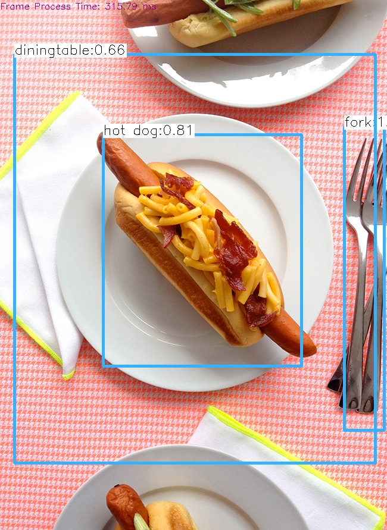
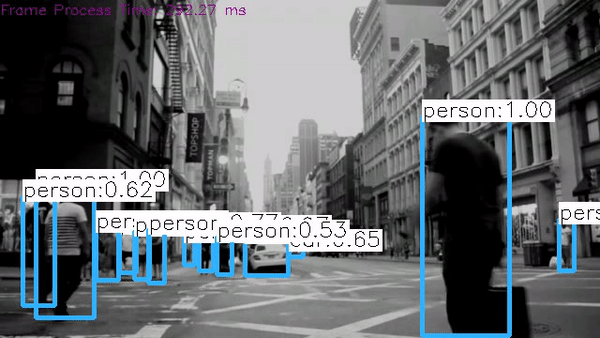

# CppND-Capstone-CV-FastObjectDetection
Computer Vision: Deep Learning based Fast Object Detection using YOLOv3 with OpenCV backend
## Description
This is an inference focused Fast Object Detection Application which uses latest version YOLOv3 (You Only Look Once) deep learning based algorithm. The published model can detect 80 images and is super fast even on a CPU when used with OpenCV as backend. This was chosen to further my interest in learning computer vision concepts and applications.

## Results of Running on Image and Video Files

  
   

## Dependencies for Running Locally
* cmake >= 3.11.3
  * All OSes: [click here for installation instructions](https://cmake.org/install/)
* make >= 4.1 (Linux, Mac), 3.81 (Windows)
  * Linux: make is installed by default on most Linux distros
  * Mac: [install Xcode command line tools to get make](https://developer.apple.com/xcode/features/)
  * Windows: [Click here for installation instructions](http://gnuwin32.sourceforge.net/packages/make.htm)
* OpenCV >= 3.4 with pkg-config and extra opencv_contrib modules
  * Build/ Install OpenCV from Official Source: Use provided install script `installOpenVC-3.4.sh` to build and install from the official OpenCV source code can be found [here](https://github.com/opencv/opencv). 
  * Copy script `installOpenCV-3.4.sh` to your home directory and use commands: `sudo chmod a+x installOpenCV-3.4.sh` and `./installOpenCV-3.4.sh`. 
  * Verified on my Ubuntu 18.04 machine from `/home/prasanna/` path. We will assume this path in further instructions
  * Find path of OpenCV Libraries with `sudo updatedb` and `locate libopencv_highgui.so.3.4`, which in my case was `/home/prasanna/installation/OpenCV-3.4/lib`
  * Add OpenCV Library path to newly created file `/etc/ld.so.conf.d/opencv.conf`. File should have a single line with `/home/prasanna/installation/OpenCV-3.4/lib`
  * Ensure this gets included with `sudo ldconfig -v`
* gcc/g++ >= 5.4
  * Linux: gcc / g++ is installed by default on most Linux distros
  * Mac: same deal as make - [install Xcode command line tools](https://developer.apple.com/xcode/features/)
  * Windows: recommend using [MinGW](http://www.mingw.org/)
* Get YOLOv3 Object Detection Model
  * Use getYOLOv3.sh script with commands: `sudo chmod a+x getYOLOv3.sh` and `./getYOLOv3.sh`
  * This gets the model with pre-trained weights, configuration data, and class names and saves them into the `data` folder

## Basic Build Instructions
1. Clone this repo.
2. Ensure all above Dependencies mentioned above are available on your machine with emphasis on installing OpenCV as described above
3. Get YOLOv3 Deep Neural Network Object Detection Model: `sudo chmod a+x getYOLOv3.sh && ./getYOLOv3.sh`
3. Make a build directory in the top level directory: `mkdir build && cd build`
4. Compile: `cmake .. && make`

## Test Instructions
1. Run on image: `./yolov3_object_detect --image=../data/hotdogFork.jpg`. Apart from displaying the result, a new output file `../data/hotdogFork_out.jpg` is created with objects detected by a bounding box and a probability match with the class detected
2. Run on video: `./yolov3_object_detect --video=../data/NYC_Junction.mp4`. Apart from displaying results, a new ouput file `../data/NYC_Junction_out.avi` is created with objects detected by a bounding box and a probability match with the class detected

## Rubric Criteria Met
### 2 Basic/ Mandatory Criteria:
1. README with Description, Instructions, Motivation, etc.
2. Compiling and Testing along with set up and test outputs are described in detail
### 5 Chosen Criteria:
3. Loops, Functions, I/O:
  a. The project demonstrates an understanding of C++ functions and control structures: Helper functions and loops are used
  b. The project reads data from a file and process the data, or the program writes data to a file: Reads data from image or video files and outputs to image or video files respectively
  c. The project accepts user input and processes the input: Uses input image or video file provided by user as input
4. Object Oriented Programming:
  a. Classes encapsulate behavior: Usage of OpenCV classes and their member functions that help encapsulate behavior
5. Memory Management:
  a. The project makes use of references in function declarations: All 3 helper functions called from main uses pass by reference effectively to create post-processed frames  
    
## References
* learnopencv.com
* pixabay.com
